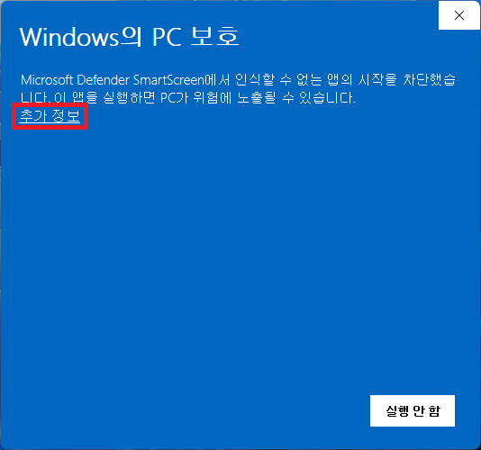
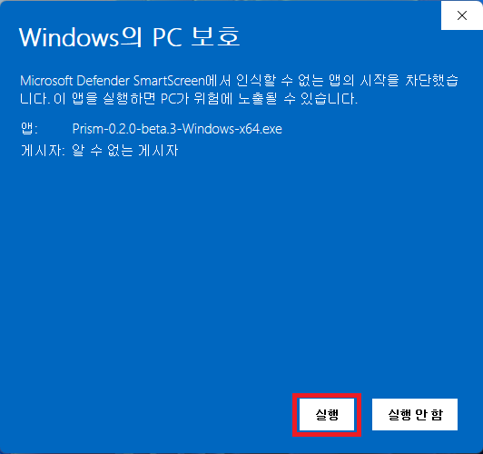

# Windows 설치 안내

1. 저장소 첫 화면 또는 릴리즈의 **Windows x64 설치·실행 패키지 ZIP**을 다운로드합니다. 압축을 풀고 동봉한 **Prism_설치_및_실행_가이드_Windows.pdf**를 먼저 확인한 뒤 EXE를 실행합니다.

2. **Windows의 PC 보호** 화면이 나타나면 공식 Prism 릴리스에서 받은 파일인지 확인한 뒤 **추가 정보**를 누릅니다.

3. 앱 이름이 `Prism`으로 시작하는지 확인하고 **실행**을 누릅니다.

4. 설치 화면의 안내에 따라 설치합니다. 기본 설치 위치는 `%LOCALAPPDATA%\Programs\Prism`이며 바탕화면 바로가기를 선택할 수 있습니다. 설치가 끝나면 다운로드한 EXE는 삭제해도 됩니다.

스크린샷의 파일명은 촬영 당시 버전입니다. 실제 파일명은 내려받은 Prism 버전에 따라 달라질 수 있습니다.

각 배포 파일의 SHA-256은 해당 릴리즈의 `SHA256SUMS.txt`에서 확인할 수 있습니다. SHA-256은 파일이 배포 후 바뀌지 않았는지 확인하기 위한 공개 정보입니다.

[설치 가이드 PDF](guides/Prism_설치_및_실행_가이드_Windows.pdf)
